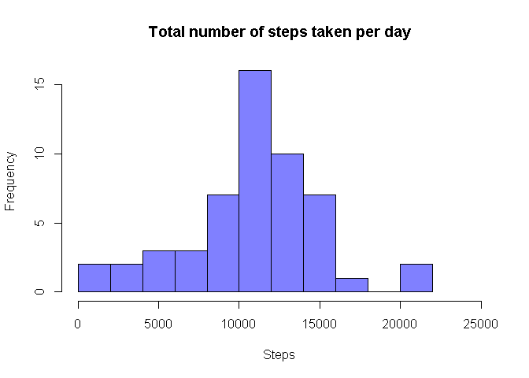
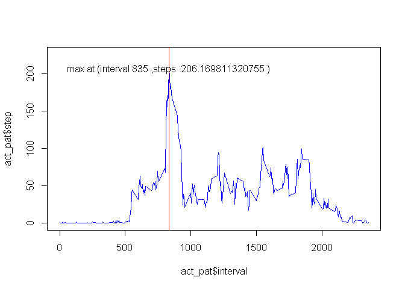
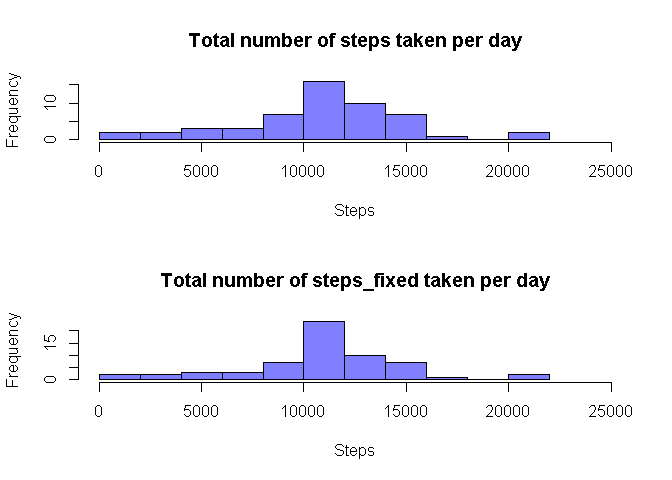
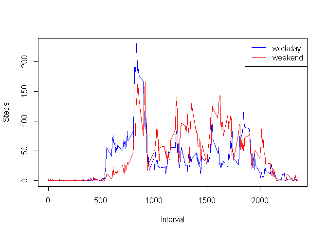

# Reproducible Research: Peer Assessment 1


## Loading and preprocessing the data

```r
if(!file.exists("activity.csv")){
  unzip("repdata_data_activity.zip")
}
my_act <- read.csv('activity.csv', header=T)
my_act$date <- as.Date(my_act$date, format="%Y-%m-%d")
```

## What is mean total number of steps taken per day?

```r
steps_per_day <- aggregate(steps ~ date, data=my_act, FUN=sum, na.action=na.pass)
hist(steps_per_day$steps, breaks=10, main="Total number of steps taken per day", xlab="Steps", xlim=c(0,25000), col='#8080ff')
```

 

```r
mean(steps_per_day$steps, na.rm=T)
```

```
## [1] 10766.19
```

```r
median(steps_per_day$steps, na.rm=T)
```

```
## [1] 10765
```


## What is the average daily activity pattern?

```r
act_pat <- aggregate(steps ~ interval, data=my_act, FUN=mean, na.action=na.omit)
max_step_id <- which.max(act_pat$steps)
max_step_inv <- act_pat$interval[max_step_id]
max_step <- act_pat$steps[max_step_id]
plot(act_pat$interval, act_pat$step, col="blue", type="l", ylim=c(0, max_step+20))
abline(v=max_step_inv, col="red")
text(x=max_step_inv, y=max_step, labels=paste("max at (interval",max_step_inv,",steps ",max_step, ")"))
```

 


## Imputing missing values

```r
my_new_act <- my_act
sum(is.na(my_new_act$steps))
```

```
## [1] 2304
```

```r
my_new_act$id <- 1:nrow(my_new_act)
a <- merge(my_new_act, act_pat, by="interval", all.x=T)
a <- a[order(a$id),]

my_new_act$steps_fixed <- ifelse(is.na(a$steps.x), a$steps.y, a$steps.x)

steps_fixed_per_day <- aggregate(steps_fixed ~ date, data=my_new_act, FUN=sum, na.action=na.pass)
par(mfrow=c(2,1))
hist(steps_per_day$steps, breaks=10, main="Total number of steps taken per day", xlab="Steps", xlim=c(0,25000), col='#8080ff')
hist(steps_fixed_per_day$steps_fixed, breaks=10, main="Total number of steps_fixed taken per day", xlab="Steps", xlim=c(0,25000), col='#8080ff')
```

 

```r
par(mfrow=c(1,1))
mean(steps_fixed_per_day$steps_fixed, na.rm=T)
```

```
## [1] 10766.19
```

```r
median(steps_fixed_per_day$steps_fixed, na.rm=T)
```

```
## [1] 10766.19
```


## Are there differences in activity patterns between weekdays and weekends?

```r
Sys.setlocale("LC_TIME", "English")
```

```
## [1] "English_United States.1252"
```

```r
my_new_act$weekday <- as.character(weekdays(my_new_act$date, abbreviate = T))
my_new_act$weekend <- ifelse(my_new_act$weekday %in% c("Sat", "Sun"), "weekend", "workday" )
my_new_act$weekend <- as.factor(my_new_act$weekend)

steps_fixed_per_weekend <- aggregate(steps_fixed ~ weekend * interval, data=my_new_act, FUN=mean, na.action=na.pass)

w1 <- subset(steps_fixed_per_weekend, steps_fixed_per_weekend$weekend =="workday")
w2 <- subset(steps_fixed_per_weekend, steps_fixed_per_weekend$weekend =="weekend")
plot(w1$interval, w1$steps_fixed, type="l", col="blue", xlab="Interval", ylab="Steps", main="")
lines(w2$interval, w2$steps_fixed, col="red")
legend(legend=c("workday","weekend"), col=c("blue", "red"), x="topright", lty=1)
```

 
